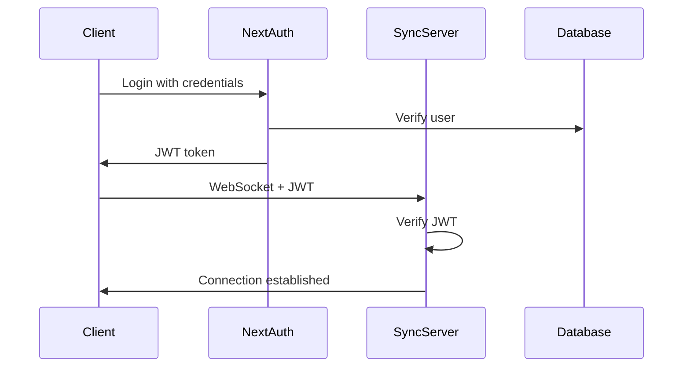
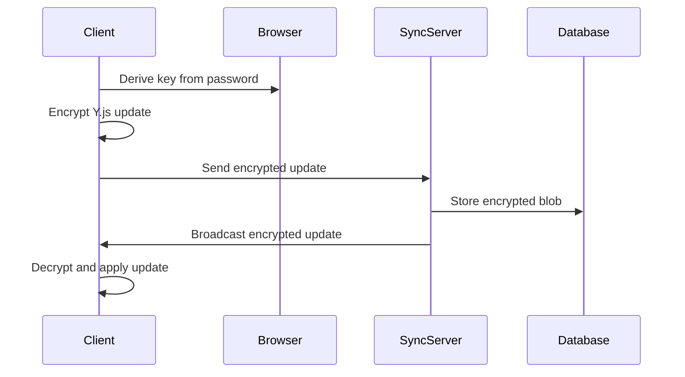

# 🏗️ Architecture Decisions & Migration Strategies

> **Key architectural decisions, technical rationale, and migration strategies for EuPlan development**

---

# 🎯 Core Architectural Principles

## 1. **Zero-Knowledge Privacy**
**Decision:** Implement client-side encryption with server-side encrypted blob storage

**Rationale:**
- Users retain full control over their data
- Server compromise doesn't expose user content
- Complies with privacy regulations (GDPR, etc.)
- Builds trust through technical guarantees

**Implementation:**
- AES-256-GCM encryption on client
- PBKDF2 key derivation from user password
- Server stores only encrypted Y.js document blobs
- No server-side decryption capabilities

## 2. **CRDT-Based Collaboration**
**Decision:** Y.js as the foundation for real-time collaborative editing

**Rationale:**
- Conflict-free replicated data types handle concurrent edits elegantly
- Proven technology (used by Figma, Linear, etc.)
- Strong ecosystem with Tiptap integration
- Offline-first capabilities built-in

**Trade-offs:**
- ✅ Robust conflict resolution
- ✅ Offline editing support
- ✅ Real-time synchronization
- ⚠️ Learning curve for complex operations
- ⚠️ Bundle size considerations

## 3. **Hybrid Storage Architecture**
**Decision:** SQLite (client) + PostgreSQL (server) dual-layer persistence

**Rationale:**
- **Client SQLite:** Instant access, offline capabilities, performance
- **Server PostgreSQL:** Durability, backup, multi-device sync, scalability

**Data Flow:**
```
User Edit → Y.js CRDT → Client SQLite → WebSocket → Server PostgreSQL
```

## 4. **Monorepo with Domain Separation**
**Decision:** Turborepo with clear application and package boundaries

**Structure:**
- `apps/web` - Next.js web application
- `apps/sync-server` - NestJS WebSocket server
- `apps/mobile` - React Native mobile app (future)
- `packages/core` - Shared business logic and utilities

**Benefits:**
- Code sharing across platforms
- Consistent development experience
- Atomic deployments
- Type safety across applications

---

# 🔄 Migration Strategies

## Phase 1: Authentication to Document Storage Migration

### Current State Analysis
```typescript
// Current YjsProvider implementation
const docId = 'main-document'; // ❌ Hardcoded
const doc = new Y.Doc();
```

### Migration Strategy
**Approach:** Gradual migration with backward compatibility

**Step 1:** Add user context awareness
```typescript
// New implementation
const { data: session, status } = useSession();
const docId = session?.user?.id ? `user-${session.user.id}-main` : null;
```

**Step 2:** Implement document schema
```sql
-- Migration: 001_add_documents_table.sql
CREATE TABLE documents (
  id UUID PRIMARY KEY DEFAULT gen_random_uuid(),
  user_id TEXT NOT NULL REFERENCES "user"(id) ON DELETE CASCADE,
  title TEXT NOT NULL DEFAULT 'Untitled Document',
  encrypted_content BYTEA,
  created_at TIMESTAMP DEFAULT NOW(),
  updated_at TIMESTAMP DEFAULT NOW()
);
```

**Step 3:** Migrate existing data
```typescript
// Data migration utility
async function migrateExistingDocuments() {
  // Move hardcoded documents to user-specific documents
  // Preserve existing Y.js state during migration
}
```

### Risk Mitigation
- **Data Loss Prevention:** Backup existing localStorage data
- **Rollback Plan:** Keep old implementation as fallback
- **Gradual Rollout:** Feature flag for new document system

## Phase 2: Real-Time Sync Server Migration

### Current State
- Local-only Y.js documents
- No real-time collaboration
- Manual save/load cycle

### Migration Strategy
**Approach:** Additive implementation with graceful degradation

**Step 1:** WebSocket server implementation
```typescript
// NestJS WebSocket Gateway
@WebSocketGateway({
  cors: { origin: process.env.WEB_APP_URL },
  namespace: '/collaboration'
})
export class CollaborationGateway {
  // Y.js document room management
  // JWT authentication
  // Document persistence coordination
}
```

**Step 2:** Client WebSocket integration
```typescript
// Enhanced YjsProvider
const websocketProvider = new WebsocketProvider(
  syncServerUrl, 
  docId, 
  doc,
  { connect: false } // Manual connection control
);

// Connect only when authenticated
if (session?.user) {
  websocketProvider.connect();
}
```

**Step 3:** Offline-first design
```typescript
// Connection state management
const [connectionState, setConnectionState] = useState<'offline' | 'connecting' | 'online'>('offline');

// Automatic reconnection with exponential backoff
const reconnect = useCallback(() => {
  // Implement robust reconnection logic
}, []);
```

### Deployment Strategy
- **Blue/Green Deployment:** Deploy sync server alongside existing system
- **Feature Toggle:** Enable real-time sync per user/document
- **Progressive Rollout:** Start with test users, expand gradually
- **Fallback Mechanism:** Maintain local-only mode as backup

## Phase 3: Encryption Layer Migration

### Current State
- Plaintext document storage
- No encryption at rest or in transit

### Migration Strategy
**Approach:** Transparent encryption with key derivation

**Step 1:** Crypto utilities implementation
```typescript
// packages/core/lib/crypto/encryption.ts
export class DocumentEncryption {
  static async deriveKey(password: string, salt: Uint8Array): Promise<CryptoKey> {
    // PBKDF2 key derivation
  }
  
  static async encrypt(data: Uint8Array, key: CryptoKey): Promise<EncryptedBlob> {
    // AES-GCM encryption
  }
  
  static async decrypt(encrypted: EncryptedBlob, key: CryptoKey): Promise<Uint8Array> {
    // AES-GCM decryption
  }
}
```

**Step 2:** YjsProvider encryption integration
```typescript
// Transparent encryption layer
const encryptedUpdate = await DocumentEncryption.encrypt(update, userKey);
await saveToDatabase(docId, encryptedUpdate);
```

**Step 3:** Server-side encryption support
```typescript
// Server only handles encrypted blobs
interface EncryptedDocument {
  id: string;
  userId: string;
  encryptedContent: Buffer; // Never decrypted server-side
  salt: Buffer; // For key derivation     
}
```

### Security Considerations
- **Key Management:** Derive from user password, never store plaintext keys
- **Salt Generation:** Unique salt per user for key derivation
- **Forward Secrecy:** Implement key rotation mechanism (future)
- **Audit Trail:** Security audit of encryption implementation

---

# 🔧 Technical Implementation Details

## Database Schema Evolution

### Phase 1 Schema
```sql
-- Core user and document relationship
CREATE TABLE documents (
  id UUID PRIMARY KEY DEFAULT gen_random_uuid(),
  user_id TEXT NOT NULL REFERENCES "user"(id) ON DELETE CASCADE,
  title TEXT NOT NULL DEFAULT 'Untitled Document',
  created_at TIMESTAMP DEFAULT NOW(),
  updated_at TIMESTAMP DEFAULT NOW()
);

CREATE INDEX idx_documents_user_id ON documents (user_id);
```

### Phase 2 Schema (Sync Support)
```sql
-- Add collaboration metadata
ALTER TABLE documents ADD COLUMN last_sync_at TIMESTAMP;
ALTER TABLE documents ADD COLUMN version INTEGER DEFAULT 1;
ALTER TABLE documents ADD COLUMN collaborator_count INTEGER DEFAULT 1;

-- Document access control
CREATE TABLE document_access (
  document_id UUID REFERENCES documents(id) ON DELETE CASCADE,
  user_id TEXT REFERENCES "user"(id) ON DELETE CASCADE,
  access_level TEXT NOT NULL DEFAULT 'read', -- 'read', 'write', 'owner'
  granted_at TIMESTAMP DEFAULT NOW(),
  PRIMARY KEY (document_id, user_id)
);
```

### Phase 3 Schema (Encryption Support)
```sql
-- Add encryption fields
ALTER TABLE documents ADD COLUMN encrypted_content BYTEA;
ALTER TABLE documents ADD COLUMN encryption_salt BYTEA;
ALTER TABLE documents ADD COLUMN encryption_version INTEGER DEFAULT 1;
```

## WebSocket Protocol Design

### Message Types
```typescript
interface CollaborationMessage {
  type: 'document-update' | 'user-join' | 'user-leave' | 'cursor-update';
  documentId: string;
  userId: string;
  data: any;
  timestamp: number;
}

interface DocumentUpdate {
  type: 'document-update';
  documentId: string;
  userId: string;
  data: {
    update: Uint8Array; // Y.js update (encrypted)
    origin: string;
  };
}
```

### Room Management
```typescript
// Document-based rooms
class DocumentRoom {
  documentId: string;
  connectedUsers: Set<string>;
  yjsDocument: Y.Doc;
  
  async handleUpdate(update: DocumentUpdate) {
    // Apply update to Y.js document
    // Broadcast to other connected users
    // Persist to database
  }
}
```

## Error Handling & Recovery

### Connection State Management
```typescript
type ConnectionState = 'offline' | 'connecting' | 'online' | 'error';

interface ConnectionManager {
  state: ConnectionState;
  reconnectAttempts: number;
  maxReconnectAttempts: number;
  backoffDelay: number;
  
  connect(): Promise<void>;
  disconnect(): void;
  reconnect(): Promise<void>;
}
```

### Conflict Resolution Strategy
```typescript
// Y.js handles most conflicts automatically
// Custom conflict resolution for specific scenarios
interface ConflictResolver {
  resolveDocumentConflict(local: Y.Doc, remote: Y.Doc): Y.Doc;
  resolveUserPermissionConflict(access: DocumentAccess[]): DocumentAccess;
  resolveEncryptionKeyConflict(keys: CryptoKey[]): CryptoKey;
}
```

---

# 📊 Performance Considerations

## Client-Side Optimization

### Bundle Size Management
- **Y.js:** ~100KB (essential for CRDT)
- **Tiptap:** ~200KB (editor functionality)
- **Crypto Libraries:** ~50KB (Web Crypto API preferred)
- **WebSocket Client:** ~20KB

**Total Addition:** ~370KB (acceptable for collaboration features)

### Memory Management
```typescript
// Y.js document cleanup
const cleanupDocument = useCallback(() => {
  if (doc) {
    doc.destroy();
  }
  if (websocketProvider) {
    websocketProvider.destroy();
  }
}, [doc, websocketProvider]);

useEffect(() => {
  return cleanupDocument;
}, [cleanupDocument]);
```

## Server-Side Optimization

### Connection Scaling
- **WebSocket Connections:** Use connection pooling
- **Room Management:** Efficient data structures for user tracking
- **Memory Usage:** Y.js document garbage collection

### Database Performance
```sql
-- Essential indexes for performance
CREATE INDEX idx_documents_user_updated ON documents (user_id, updated_at DESC);
CREATE INDEX idx_document_access_user ON document_access (user_id);
CREATE INDEX idx_documents_last_sync ON documents (last_sync_at);
```

---

# 🔐 Security Architecture

## Authentication Flow


## Encryption Flow


## Security Checklist
- ✅ **Authentication:** JWT-based with secure session management
- ✅ **Authorization:** Document-level access control
- ✅ **Encryption:** Client-side encryption with AES-256-GCM
- ✅ **Key Management:** Password-derived keys, never stored
- ✅ **Transport Security:** TLS for all communications
- ✅ **Input Validation:** Sanitize all user inputs
- ✅ **Rate Limiting:** Prevent abuse of WebSocket connections
- ✅ **Audit Logging:** Track access and modifications

---

# 🚀 Deployment Architecture

## Development Environment
```yaml
# docker-compose.yml
services:
  postgres:
    image: postgres:16
    environment:
      POSTGRES_DB: euplan_dev
      POSTGRES_USER: dev
      POSTGRES_PASSWORD: dev_password
    ports:
      - "5432:5432"
  
  redis:
    image: redis:7-alpine
    ports:
      - "6379:6379"
```

## Production Deployment
- **Web App:** Vercel (Next.js optimization, edge functions)
- **Sync Server:** Hetzner VPS (Docker container, reverse proxy)
- **Database:** Managed PostgreSQL (Railway/Neon)
- **Redis:** Managed Redis (for WebSocket scaling)

## CI/CD Pipeline
```yaml
# .github/workflows/deploy.yml
name: Deploy
on:
  push:
    branches: [main]
jobs:
  test:
    runs-on: ubuntu-latest
    steps:
      - uses: actions/checkout@v4
      - run: pnpm install
      - run: pnpm test
      - run: pnpm build
  
  deploy-web:
    needs: test
    runs-on: ubuntu-latest
    steps:
      - run: vercel --prod
  
  deploy-sync-server:
    needs: test
    runs-on: ubuntu-latest
    steps:
      - run: docker build -t sync-server .
      - run: docker push $REGISTRY/sync-server
      - run: kubectl apply -f k8s/
```

---

This architecture provides a solid foundation for scaling from MVP to production while maintaining security, performance, and user experience standards.